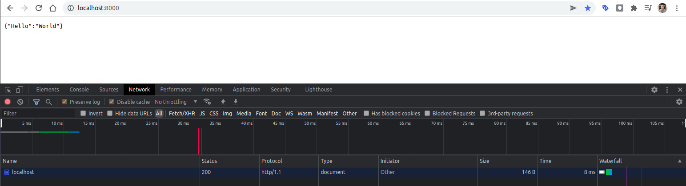
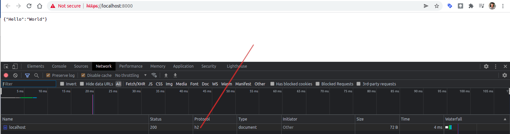

# FastAPI Http2 Demo

In this tutorial, we will implement HTTP2 use FastAPI with Hypercon web server.

## Quickstart

Install dependencies with poetry

```shell
poetry shell
poetry install
```

Start app with hypercon

```shell
hypercorn myapp:app --bind 0.0.0.0:8000
```

By default, hypercon will start a server with HTTP1.1.

On your browser, open the application at:

> http://localhost:8000/



## Run Server with HTTP 2

To start server with HTTP2, hyperson required a SSL Certificate.

### Step 1: Generate a Self-signed Certificate

Let’s create a temporary self-signed certificate using rsa for 365 days. 

```shell
openssl req -x509 -newkey rsa:4096 -keyout key.pem -out cert.pem -days 365 -nodes
```

It will generate two new files:

```
key.pem
cert.pem
```

### Step 2: Start HTTP2 server use certificate files:

```shell
hypercorn --keyfile key.pem --certfile cert.pem main:app
```

On your browser, open the app but this time using **https** instead:

> https://localhost:8000/

It should prompt a warning page indicates that (this is normal if you are using self-signed certificate):

> localhost:8000 uses an invalid security certificate.

> The certificate is not trusted because it is self-signed.

Accept the risk and proceed to the requested URL. 

You should get the following response headers like this:


